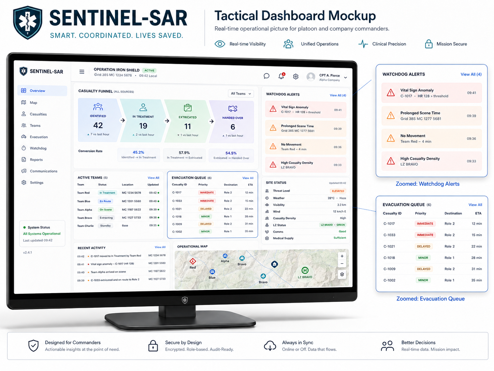
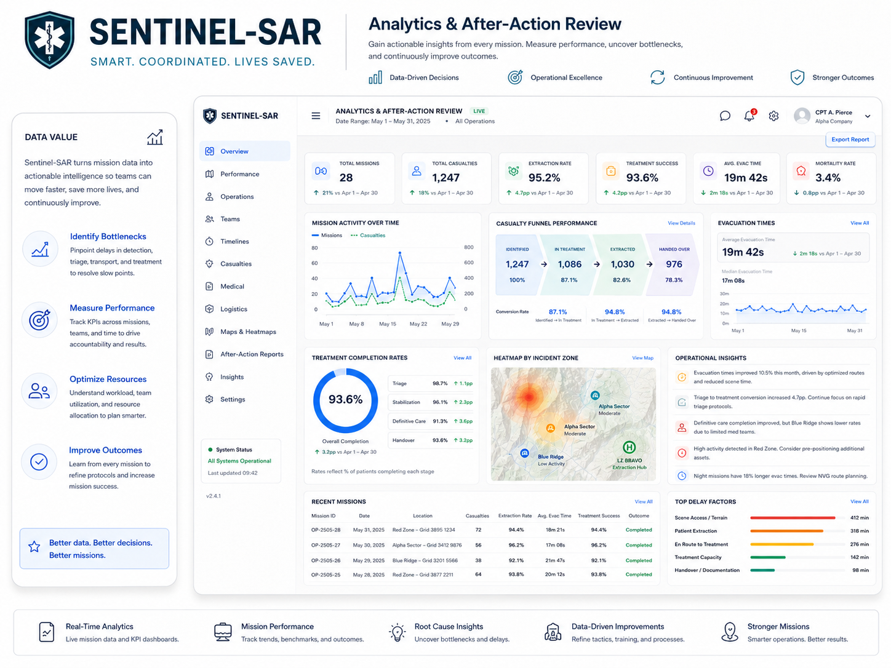
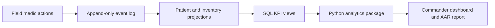

# C5 Sentinel-SAR Analytics Case Study

**Portfolio case study for data analyst and product analyst roles.**

Operational prototype: [C5 Sentinel-SAR](https://github.com/Raanank10/Medical-C5-System-For-SAR)  
Live interactive demo: [raanank10.github.io/Medical-C5-System-For-SAR](https://raanank10.github.io/Medical-C5-System-For-SAR/)



## What To Review First

| Time available | Start here |
|---|---|
| 30 seconds | Dashboard image, KPI table, and Skills Demonstrated |
| 2 minutes | `sql/kpi_views.sql` command summary and stockout-risk snippets |
| 5 minutes | `analytics/kpis.py`, `docs/METRICS_DICTIONARY.md`, and sample AAR report |
| Deep dive | [`docs/PROJECT_WALKTHROUGH.md`](docs/PROJECT_WALKTHROUGH.md) |

## Why This Repo Exists

C5 Sentinel-SAR is a mass-casualty incident command system for search-and-rescue medical teams. The operational repository contains the full product specification, UI prototype, database schema, and field workflow.

This repository is the analyst-facing version: a focused case study that shows how raw incident events become command KPIs, operational alerts, and an after-action review.

The core product question:

> How can commanders understand patient load, clinical urgency, supply risk, and team performance during a chaotic offline-first rescue event?

## Skills Demonstrated

| Area | Evidence in this repo |
|---|---|
| SQL analytics | KPI views, event-log projections, operational summary queries |
| Python analytics | Reproducible KPI engine, demo SQLite database, chart/report generation |
| Product analytics | Metrics mapped to user decisions, alert thresholds, commander workflow |
| Data modeling | Event-sourced patient log, append-only inventory ledger, read-model views |
| Dashboard thinking | Commander view, alert prioritization, triage distribution, stockout risk |
| Communication | Executive summary, metrics dictionary, case-study narrative |

## Analyst Case Study Summary

| Question | Analytical answer |
|---|---|
| What is happening now? | Active patients, triage mix, open critical alerts, active medics |
| What needs action first? | Priority score combining triage, vitals, tourniquet state, and stale assessment age |
| What could fail next? | Stockout risk, stale device sync, medic overload |
| What happened after the incident? | AAR report with KPI summary, timeline, and operational lessons |

## Analytics Package

The `analytics/` folder contains a standalone Python package that turns rescue event data into measurable command insight.

| KPI | Definition | Decision supported |
|---|---|---|
| Golden Hour compliance | Patients handed over within 60 minutes of injury | Is evacuation fast enough? |
| Triage distribution | Red, Yellow, Green, Black patient counts | Where should medics and stretchers go first? |
| Triage override rate | Cases where medic judgment overrides algorithmic MSTART | Is the algorithm aligned with field reality? |
| Tourniquet risk | Active tourniquets approaching or passing 120 minutes | Which patient needs urgent intervention? |
| Stockout risk | Minutes to empty based on inventory ledger burn rate | Which sector needs resupply? |
| Sync latency p95 | 95th percentile device-to-server event delay | Is offline sync healthy enough for command decisions? |



## Data Flow



## Repository Structure

| Path | Purpose |
|---|---|
| `analytics/` | Python KPI engine, demo DB, chart/report code, sample AAR HTML |
| `sql/kpi_views.sql` | Curated SQL examples showing command KPIs and risk logic |
| `docs/METRICS_DICTIONARY.md` | Metric definitions, source tables, and thresholds |
| `docs/CASE_STUDY_NOTES.md` | Product analytics framing and design rationale |
| `docs/PROJECT_WALKTHROUGH.md` | 30-second and 2-minute project narrative, key technical points |
| `assets/` | Dashboard and analytics visuals for fast portfolio scanning |

## Run The Demo Analytics

```powershell
cd analytics
python -m pip install -r requirements.txt
python seed_demo_db.py
```

Then open `analytics/aar_report_v1_1.html` to inspect the generated after-action review sample.

The package also includes `analytics_demo.ipynb` for notebook-based exploration.

## Design Decisions Worth Discussing

1. Why the event log is the right source of truth for offline-first emergency workflows.
2. How to choose KPI thresholds that create action instead of dashboard noise.
3. Why command metrics must avoid Cartesian join inflation when combining patients, alerts, and devices.
4. How product analytics changes when the environment is high stress, gloved, mobile, and partially disconnected.
5. How the same data model supports both real-time operations and post-incident review.

## Scope Note

This is a portfolio analytics case study using demo data. It is not a certified medical device, not connected to real patient data, and not intended for operational deployment without formal review, security hardening, clinical validation, and organizational approval.
